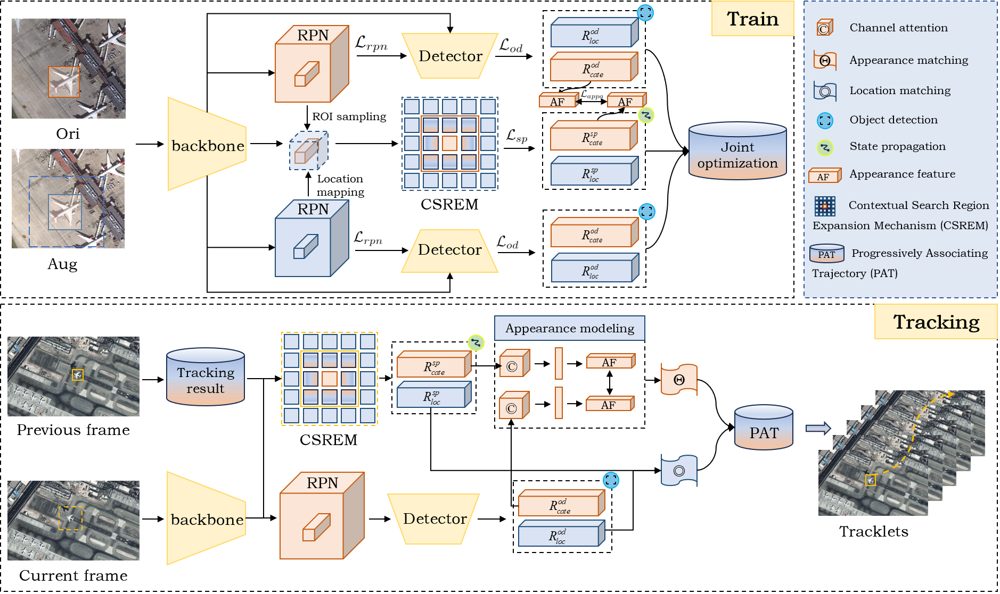

# Propagating Spatio-temporal State and Progressively Associating Trajectory for Satellite Video Multiple Object Tracking (PS2PAT-MOT)

## Framework


## File Directory Description
```
PS2PAT-MOT
├── configs
│   ├── AIRMOT.yaml
│   ├── DOTA_AUG.yaml
│   ├── SATMTB_aircraft.yaml
│   └── SATMTB_ship.yaml
├── datasets
│   ├── AIRMOT
│   │   ├── annotation
│   │   │   ├── anno.json
│   │   │   └── splits.json
│   │   └── raw_data
│   │       ├── test
│   │       │   ├── 001
│   │       │   ├── 005
│   │       │   ├── 010
│   │       │   └── ...
│   │       └── train
│   │           ├── 002
│   │           ├── 003
│   │           ├── 004
│   │           └── ...
├── maskrcnn
│   ├── apex
│   ├── cityscapesScripts
│   ├── cocoapi
│   └── maskrcnn-benchmark
├── pretrained
│   └── frcnn_dla34.pth
├── ps2pat
│   ├── configs
│   ├── data
│   ├── engine
│   ├── eval
│   ├── modelling
│   ├── operator_patch
│   └── utils
└── tools
    ├── DETRAC_xmlParser.py
    ├── ingest_uadetract.py
    ├── test_net.py
    └── train_net.py
```

## Usage

### Installation
```
git clone https://github.com/HELOBILLY/PS2PAT-MOT.git
cd PS2PAT-MOT
conda env create -f environment.yaml
conda activate ps2mot
export PYTHONPATH=.:$PYTHONPATH
```

### Compile 

#### 1 pycocotools
```
cd maskrcnn
git clone https://github.com/cocodataset/cocoapi.git
cd cocoapi/PythonAPI
python setup.py build_ext install
```

#### 2 cityscapesScripts
```
cd maskrcnn
git clone https://github.com/mcordts/cityscapesScripts.git
cd cityscapesScripts/
python setup.py build_ext install
```

#### 3 apex (ensure the PyTorch version installed in the ps2mot environment matches the CUDA version on your local machine)
```
cd maskrcnn
git clone https://github.com/NVIDIA/apex.git
cd apex
python setup.py install --cuda_ext --cpp_ext
```

#### 4 maskrcnn
```
cd maskrcnn
git clone https://github.com/facebookresearch/maskrcnn-benchmark.git
cd maskrcnn-benchmark
cuda_dir="maskrcnn_benchmark/csrc/cuda"
perl -i -pe 's/AT_CHECK/TORCH_CHECK/' $cuda_dir/deform_pool_cuda.cu $cuda_dir/deform_conv_cuda.cu
# You can then run the regular setup command
python3 setup.py build develop
```

### Train
```
python3 tools/train_net.py --config-file configs/AIRMOT.yaml --train-dir my_train_results/AIRMOT/ --model-suffix pth
```

### Test (automatically perform evaluation after testing)
```
python3 tools/test_net.py --config-file configs/dla/AIRMOT.yaml --output-dir datasets/AIRMOT/my_results --model-file my_train_results/AIRMOT/model_final.pth --test-dataset AIRMOT --set test
```

### Download Links
[Google Drive](https://drive.google.com/drive/folders/1fwylyu-JeJO66GIMTniQwxsGKJXmwjYh?usp=sharing)

